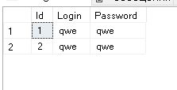
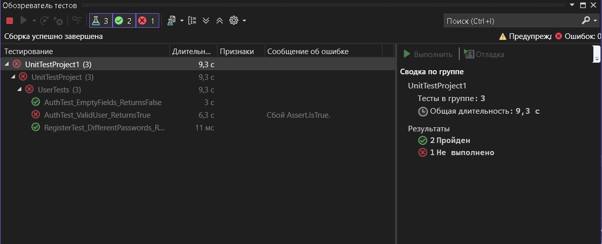

# Практическая работа №6: Создание автоматизированных Unit-тестов
## Выполнили: Арутюнов, Старшинов
#### Что сейчас есть в бд 

### Результаты тестов

| Тест                              | Статус | Причина результата                                                                 |
|:----------------------------------|:------:|------------------------------------------------------------------------------------|
| AuthTest_EmptyFields_ReturnsFalse | ✅     | Пройден. Метод Auth успешно вернул false при пустых входных строках               |
| RegisterTest_DifferentPasswords_ReturnsFalse | ✅ | Пройден. Валидация сработала верно: при несовпадении паролей регистрация отклонена |
| AuthTest_ValidUser_ReturnsTrue    | ❌     | Сбой. Ошибка Assert.IsTrue. Доступ не был предоставлен                            |

# **Анализ причин неудачного теста `AuthTest_ValidUser_ReturnsTrue`**
### Тест не пройден, так как в базе данных на момент тестирования **отсутствовал** пользователь с учетными данными, указанными в коде теста.
 Остальные тесты пройденны верно.