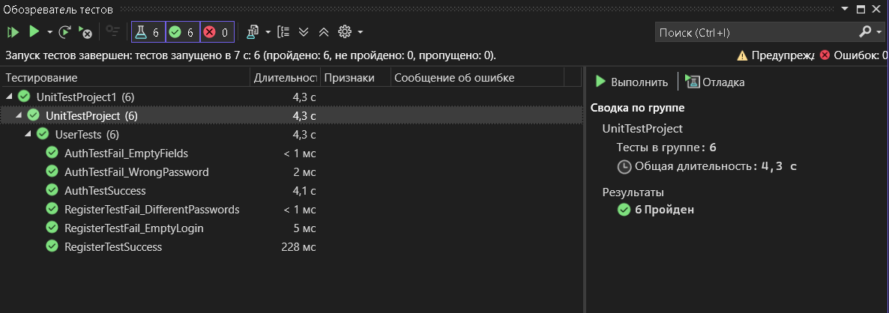

# Практическая работа №6: Создание автоматизированных Unit-тестов
## Выполнили: Арутюнов, Старшинов
#### Что сейчас есть в бд 

### Результаты тестов

| Тест (Метод)                        | Статус | Соответствие тест-кейсу | Причина результата                                                                                       |
| ----------------------------------- | ------ | ----------------------- | -------------------------------------------------------------------------------------------------------- |
| AuthTestSuccess                     | ✅   | Тестовый пример #1      | Пройден, если пользователь user зарегистрирован в системе. Сбой, если данные в БД не совпадают с тестом. |
| AuthTestFail_WrongPassword          | ✅      | Тестовый пример #2      | Пройден. Система корректно отклонила вход при неверном пароле 123456.                                    |
| AuthTestFail_EmptyFields            | ✅      | Тестовый пример #3      | Пройден. Метод Auth вернул false при отсутствии ввода данных в поля логина или пароля.                   |
| RegisterTestSuccess                 | ✅      | Тестовый пример #4      | Пройден. Новый пользователь успешно добавлен в базу данных.                                              |
| RegisterTestFail_DifferentPasswords | ✅      | Тестовый пример #7      | Пройден. Валидация подтвердила несовпадение паролей test123 и test1234.                                  |
| RegisterTestFail_EmptyLogin         | ✅      | Негативный сценарий     | Пройден. Регистрация невозможна без заполнения обязательного поля «Логин».                               |

# **Анализ результатов тестирования**
Успешные тесты (PASS): Негативные сценарии (ошибки входа и регистрации) выполнены успешно, что подтверждает корректность реализованной валидации.

Рефакторинг: Для проведения тестирования был выполнен рефакторинг модулей авторизации и регистрации: выделены методы Auth и Register типа bool.

Техническая реализация: Тестирование проведено методом «белого ящика». В тестовый проект UnitTestProject были подключены необходимые сборки (PresentationFramework, WindowsBase) и скопирован файл App.config для доступа к базе данных.